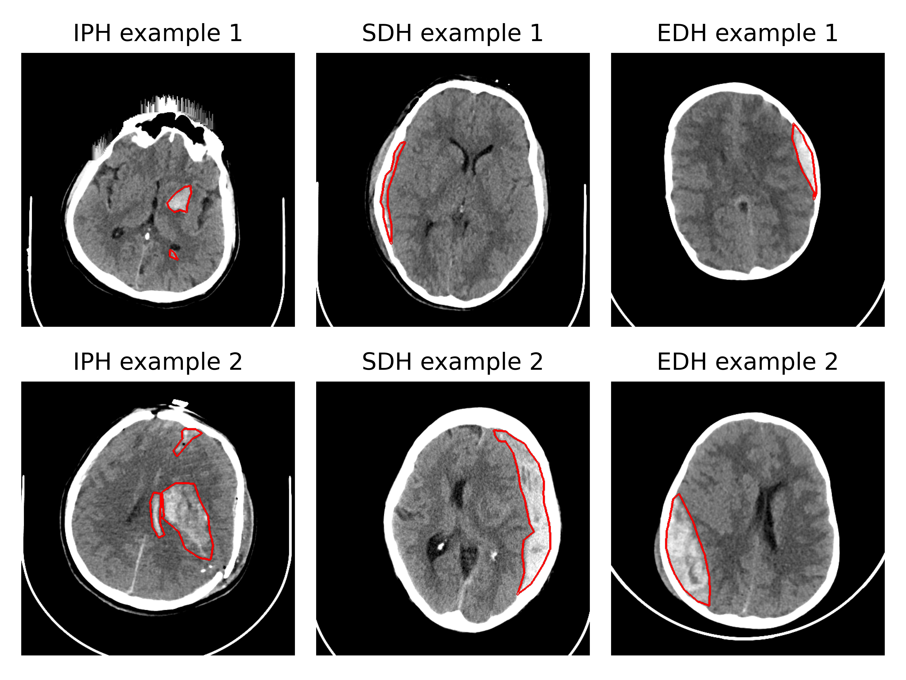
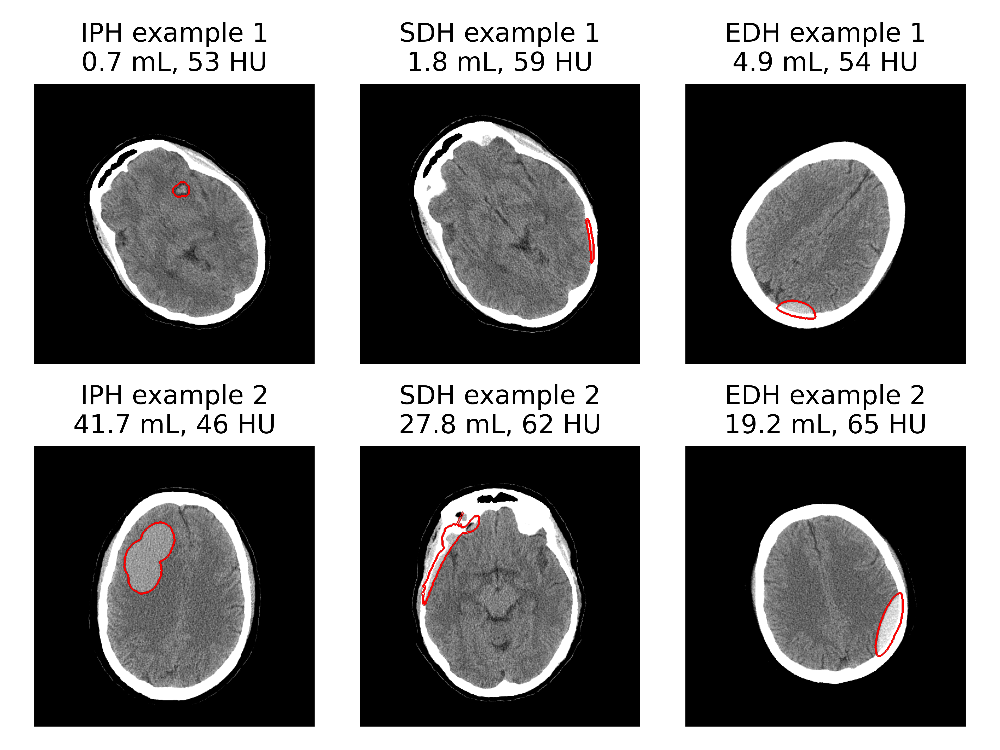
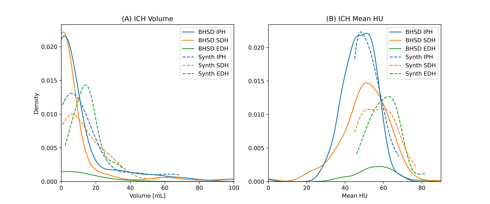
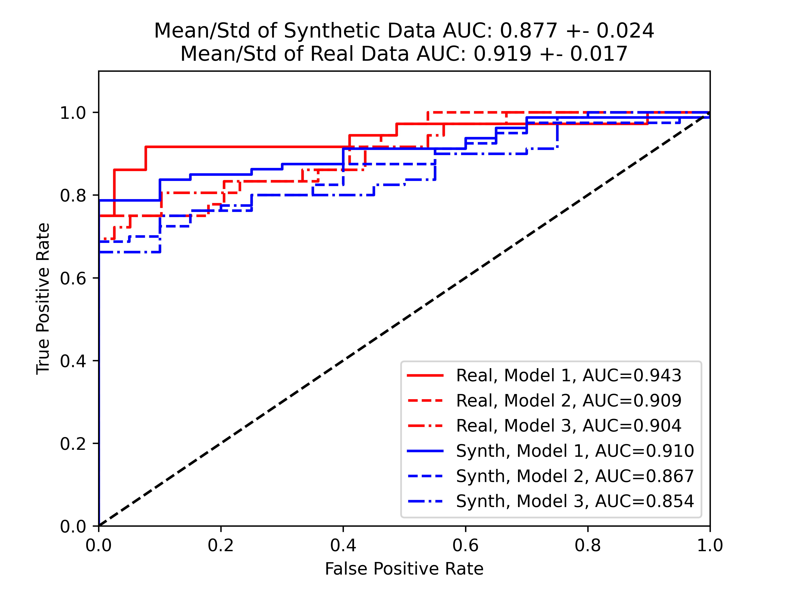

[](https://doi.org/10.5281/zenodo.15686061)

# Framework for Synthetic ICH to Assess AI Generalizability

This repository contains the code and methodologies to reproduce the results presented in the paper: **A Knowledge-Based Framework for Generating Synthetic Intracranial Hemorrhage CT Data to Assess AI Generalizability** [preprint link](https://zenodo.org/records/15686061).

Deep learning models for Computer-Assisted Detection (CAD) of intracranial hemorrhage (ICH) often struggle with generalizability when encountering CT data with characteristics underrepresented in their training sets (e.g., variations in patient demographics, hemorrhage types, or image acquisition parameters).

This project introduces an open-source framework to:

- Generate synthetic ICH CT data by inserting realistic, modeled hemorrhages (epidural, subdural, intraparenchymal) into a digital head phantom.
- Simulate mass effect and control hemorrhage volume and attenuation based on real data distributions.
- Create datasets with varied CT acquisition parameters (mAs, kVp) to robustly evaluate the generalizability of ICH detection models.

Our work validates this approach by demonstrating comparable performance of an ICH detection model on our synthetic dataset (AUC 0.877) versus an independent real dataset (AUC 0.919). This framework enables more comprehensive testing and evaluation of CAD devices for ICH.

| Real Examples                                                  | Synthetic Examples                                                  |
| :------------------------------------------------------------- | :------------------------------------------------------------------ |
|  <br> **Manuscript Figure 3** |  <br> **Manuscript Figure 5** |
| Examples of hemorrhages from an external independent ICH dataset (Hssayeni), showcasing the three hemorrhage subtypes modeled in this work: Intraparenchymal (IPH, left), subdural (SDH, left), and epidural (EDH, right). |  Small (top row) and large (bottom row) examples of each synthetic hemorrhage type: Intraparenchymal (IPH, left), subdural (SDH, left), and epidural (EDH, right).                                   |

| Comparable Feature Distributions                                  | Real vs. Synthetic Task-Based Validation                            |
| :------------------------------------------------------------- | :------------------------------------------------------------------ |
|  <br> **Manuscript Figure 4** |  <br> **Manuscript Figure 5** |
|  Histograms and kernel density estimates for the (A) volume in mL and (B) mean HU of each unique hemorrhage in the BHSD (solid lines) and the proposed synthetic dataset (dashed lines). The BHSD distributions were drawn from 1,872 unique hemorrhages, while the synthetic datasets contained 300 unique hemorrhages. |  Receiver operating characteristic (ROC) curves for detection of ICH for each dataset. The mean area under the curve (AUC) was 0.877 ± 0.024for the synthetic datasets, and 0.919 ± 0.017 for the real dataset. |

Synthetic ICH datasets were generated using [InSilicoICH](https://github.com/DIDSR/InSilicoICH).

## Installation

Note: Figures [3](manuscript_figures/Figure3.png), [8](manuscript_figures/Figure8.png) require the following dataset of real CT examples with and without ICH to be [downloaded here](https://physionet.org/content/ct-ich/1.3.1/). To reproduce these figures, place the downloaded contents inside `datasets/computed-tomography-images-for-intracranial...` prior to regenerating figures.

### 1. Clone the repo locally

```shell
git clone https://github.com/DIDSR/synthetic-ich-for-cad-evaluations.git
cd synthetic-ich-for-cad-evaluations
```

### 2. Create a python environment

```shell
conda create -n synthetic-ich-for-cad-evaluations python==3.11.* -y
conda activate synthetic-ich-for-cad-evaluations
pip install -r requirements.txt
```

### 3. Finally, set a directory to store any downloaded datasets

Default is in your working directory in `./datasets`

```shell
echo BASE_DIR=./datasets >> .env
```

You are now ready to run the notebooks and regenerate figures.

## Reproducing Figures

You can run [notebooks](notebooks) individually or all together with the [run_all](run_all.sh) script:

```shell
bash run_all.sh
```

This will take longer to run the first time as missing datasets will be downloaded to `BASE_DIR`, (4.5 GB for notebook [fig3-5_view_six_examples](notebooks.fig3-5_view_six_examples.ipynb) and (480 MB for notebook [fig6_kV_mA_variation](notebooks/fig6_kV_mA_variation.ipynb)) subsequent runs should take around 25-30 s to complete.

## Supplementary Notebooks

Additional [notebooks](notebooks) are included that were not directly related to generating manuscript figures but can be helpful for visualizing results or running the pipeline end to end (see [single_case_pipeline](notebooks/single_case_pipeline.ipynb)).

The pretrained ICH detection model used in generating [figure 5](manuscript_figures/Figure5.png) can be downloaded directly here: [Pretrained model weights](https://doi.org/10.5281/zenodo.15602166), with retraining methods and details available here: [RSNA 2019 ICH Detection Grand Challenge Fork](https://github.com/jmweaver-FDA/rsna_2019_gc).

## Disclaimer

This software and documentation (the "Software") were developed at the **US Food and Drug Administration** (FDA) by employees of the Federal Government in the course of their official duties. Pursuant to Title 17, Section 105 of the United States Code, this work is not subject to copyright protection and is in the public domain. Permission is hereby granted, free of charge, to any person obtaining a copy of the Software, to deal in the Software without restriction, including without limitation the rights to use, copy, modify, merge, publish, distribute, sublicense, or sell copies of the Software or derivatives, and to permit persons to whom the Software is furnished to do so. FDA assumes no responsibility whatsoever for use by other parties of the Software, its source code, documentation or compiled executables, and makes no guarantees, expressed or implied, about its quality, reliability, or any other characteristic. Further, use of this code in no way implies endorsement by the FDA or confers any advantage in regulatory decisions. Although this software can be redistributed and/or modified freely, we ask that any derivative works bear some notice that they are derived from it, and any modified versions bear some notice that they have been modified.
